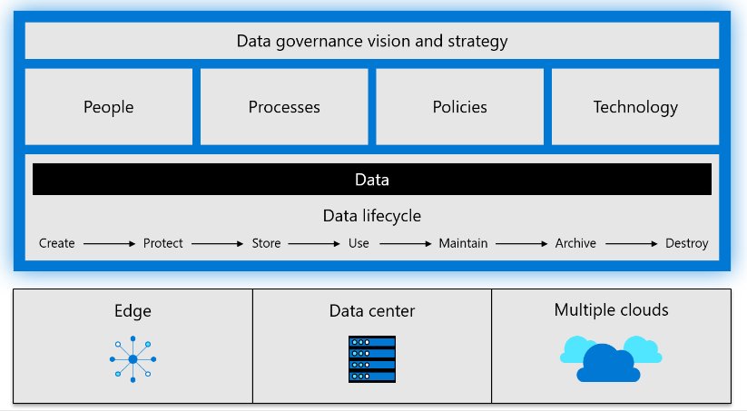
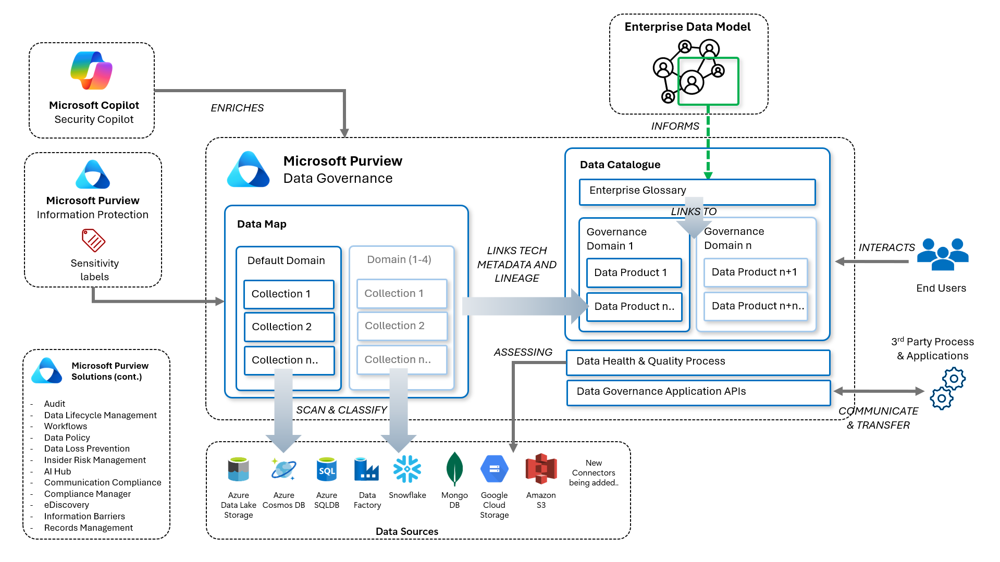

# Lab 1: Introduction & Executive Overview

## Task 1: Opening Welcome & Introductions

**⏰ Duration:** 30 minutes

**🎯 Outcome:** Given we will be spending 8 or more hours together, let's get to know one another and learn your involvement in the data governance programme.

**🫂 Team Activity:**

1. Introduce yourselves: Your Name, Role in the organization, Personal definition of Data Governance.
2. Facilitator to introduce topic and agenda for the training.
3. "How did we get here?" - Share in a few words the current state of data governance in your organization and any maturity/readiness/technical challenges you have encountered.

To level-set the conversation, the facilitator will lead a group conversation which includes the following prompts.  
_Note:_ These are targeted questions which will inform the to-be implementation.

**Data Governance Maturity**

- Do you have a [Data Steward](https://learn.microsoft.com/azure/cloud-adoption-framework/scenarios/cloud-scale-analytics/organize-roles-responsibilities#:~:text=Platform%20group%2C%20governance-,Data%20Steward,-Data%20Trustee) in your organization? Who is it?
- Do you currently have a [data catalog](https://learn.microsoft.com/purview/what-is-data-catalog#:~:text=Data%20Catalog%20experience%20allows%20you%20to%20explore%20and%20understand%20your%20data) in place? How does it work? Is it effective?

**Requirements**

- Is your organization subject to [compliance](https://learn.microsoft.com/azure/compliance/) obligations that require metadata to be stored in a specific region? If you do, where is your data catalog located today?
- Do you already have M365 - Enterprise [Data Security](https://learn.microsoft.com/purview/purview?view=o365-worldwide#data-security) policies in place (Information Protection / Sensitivity Labels, Insider Risk Management, Information Barriers etc)?
- Do you have an AI / Generative [AI policy](https://learn.microsoft.com/azure/cloud-adoption-framework/strategy/responsible-ai#the-responsible-ai-principles) in place? If so, how do you manage data exposure risks?
- Are there any on-premises systems which should be cataloged as part of the data governance / cataloging initiative?
- Do you consume any critical third-party (external) data sources / APIs?

**Implementation**

- What are the success metrics that matter to business stakeholders?
- Given data governance is interdisciplinary, have you considered use cases and identified stakeholders throughout the business?
- Have you figured out how data governance costs will be apportioned?
- Have you planned your path to production? and do you have dates in mind for a data catalog go-live?

## Task 2: Executive Overview

**⏰ Duration:** 75 minutes

**🎯 Outcome:** The facilitator will provide an executive overview of the Microsoft view of data governance, the industry trends, and the Purview Data Governance application.

Provide a overview of the [Cloud Adoption Framework](https://learn.microsoft.com/azure/cloud-adoption-framework/) for Data Governance;

- Define [Data Governance](https://learn.microsoft.com/azure/cloud-adoption-framework/scenarios/cloud-scale-analytics/overview-cloud-scale-analytics#govern-your-analytics-estate) and its value.
- Discuss the [Data governance maturity model](https://learn.microsoft.com/azure/cloud-adoption-framework/scenarios/cloud-scale-analytics/govern#data-governance-maturity-model) and invite the group to assess their organisation.
- Discuss typical Cx [requirements for data governance](https://learn.microsoft.com/azure/cloud-adoption-framework/scenarios/cloud-scale-analytics/govern-requirements).
- Discuss typical [Data governance processes](https://learn.microsoft.com/azure/cloud-adoption-framework/scenarios/cloud-scale-analytics/govern-components).
- Briefly cover off the [Reference model for planning](https://learn.microsoft.com/purview/data-catalog-get-started?view=o365-worldwide#reference-model-for-planning) guidance.

Next cover the Industry Challenges and an Introduction to Microsoft Purview.

At a summary level - Purview Data Governance contains two main components:

- The Data Map – technical metadata and lineage from source are ingested and structured via the logical constructs of Domains & Collections.
- The Data Catalog - organizing, annotating, and publishing data, so that its accessible and understood by end-users, reflecting enterprise terminology and context. The abstraction of “data products” provide the linkage to the technical metadata and lineage from the data map.

_Provide a overview of the Cloud Adoption Framework for Data Governance:_

- Discuss the value proposition of Purview and Federated Data Governance.
- Discuss Responsible Data Value Creation and Data Democratization.
- Discuss the previously separate services that Purview now brings together.
- Talk about the high-level architectural overview of Purview Data Governance.
- Mention the personas involved in the data governance process.
- Discuss the Classic Model vs the New Model's concepts.
- Mention the design principles of Purview and key commitments.
- Tie the conversation back to Federated Data Governance.
- Mention the ecosystem piece again and the opportunities that a single instance of Microsoft Purview can bring to organizations.

## 🍎 Break: 15 Minutes

Well done! This part Lab has shown you to the value of Microsoft Purview for federated data governance. Take a few minutes before moving on to the next Lab.

## Move on to Lab 2

**⏸️ Reflection:** At this point in the masterclass, you have learnt the value of Microsoft Purview and how a federated data governance model can be adopted to scale enterprise-wide.

👉 [Continue: Lab 2](./Lab-02%20-%20Designing%20the%20Data%20Map.md)
