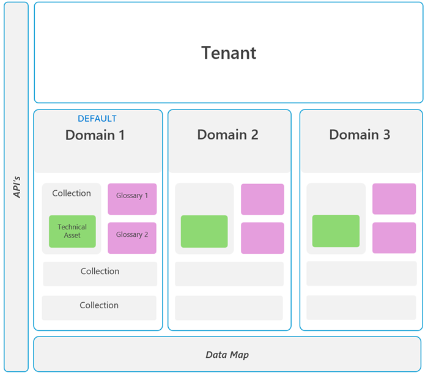
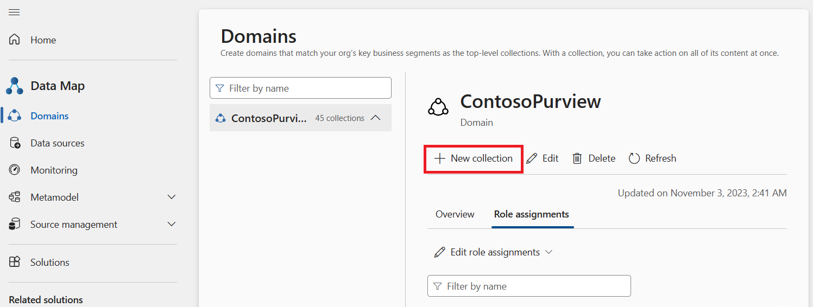
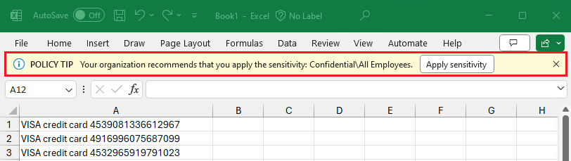
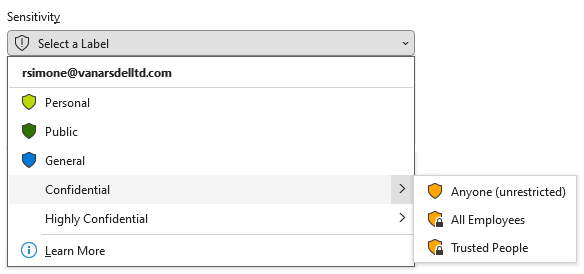
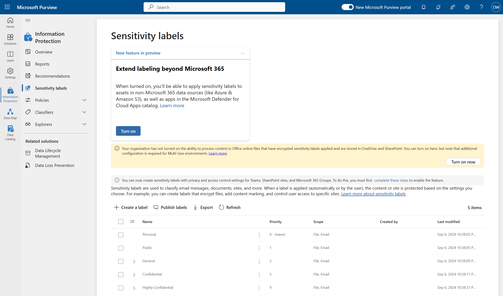
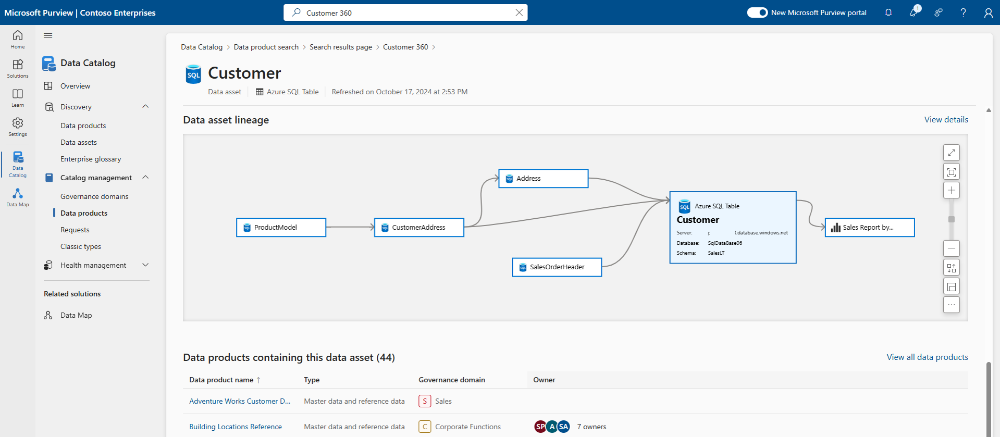
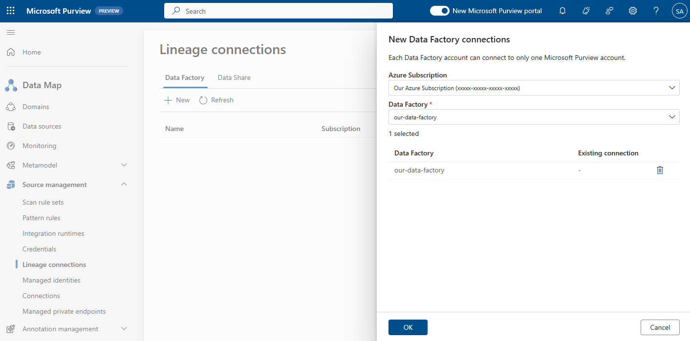
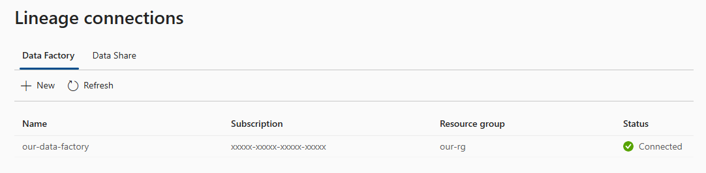

# Lab 2: Designing the Data Map

## Task 1: Consider the Design

> Microsoft Purview Solution: Data Map

**⏰ Duration:** 30 minutes

**🎯 Outcome:** At the end of this task, you will have answered important questions that will form part of the structure of the workshop and help to focus the session.

**🫂 Team Activity:** [30 minutes] Together as a group, revisit the questions posed at the start of Lab 1, adding a little detail around each answer to guide you in the following exercises.

- Are you interested in Purview's Security, Privacy, and Compliance capabilities too, or just Purview Data Governance over structured data?
- Have you got the respective Microsoft 365 Enterprise license to test out the Security/Privacy/Compliance features?
- Do you have M365 - E3/E5 Data Security policies in place already (Information Protection, Insider Risk Management, Information Barriers etc)?
- Are there any on-premises services that need to be considered/evaluated as part of the Purview Data Governance / cataloging initiative?
- Given data governance is interdisciplinary, have you considered use cases and identified stakeholders throughout the business?
- Have you figured out how data governance costs will be apportioned?
- Have you planned your path to production?

If you were unable to answer many of these questions, lets aim to get clarity at the end of the session/workshop - once capabilities become clearer to you.

## Task 2: Create your Platform Domains

> Microsoft Purview Solution: Data Map

**⏰ Duration:** 10 minutes

**🎯 Outcome:** At the end of this task, you will have implemented a platform domain and will be able to divide your Purview Data Map based on environment, isolation, and security requirements.

### Understanding Platform Domains

> Source: [Domains](https://learn.microsoft.com/purview/concept-domains)

Microsoft Purview has introduced ['domains'](https://learn.microsoft.com/purview/concept-domains) (not to be confused with the [Governance Domains](https://learn.microsoft.com/purview/what-is-data-catalog#governance-domains) concept) as a structure within the Microsoft Purview Data Map. Domains are designed to distribute organizational responsibility, create logical separation, ensuring consistent management across assets and glossaries.

One of the most significant changes in the new experience is the replacement of multiple data governance accounts within a tenant (the classic Azure Purview approach) with multiple domains under an default Purview account for that tenant.

**Key Facts:**

- Every Microsoft Purview Data Map starts with a [default domain](https://learn.microsoft.com/purview/concept-domains#default-domain). This domain is the primary account's root collection when an account is upgraded to the new experience. 
  - Up to 4 additional custom domains can be created for better organization and governance. 
- A new role, the [Domain Admin](<https://learn.microsoft.com/purview/governance-roles-permissions#domain-and-collection-permissions:~:text=roles%20are%20currently%3A-,Domain%20admin,-(domain%20level)>), can be assigned. They will have the ability to assign permissions within that domain and manage its resources.
- You will be able to [merge](https://learn.microsoft.com/purview/merge-domain?source=docs) exiting (classic) Azure Purview accounts within your tenant into the new Microsoft Purview experience using domains.

- Each Data Map has 1-5 Domains. Each Domain can have up to [256 collections](https://learn.microsoft.com/purview/concept-best-practices-collections#:~:text=A%20collections%20hierarchy%20in%20a%20Microsoft%20Purview%20can%20support%20as%20many%20as%20256%20collections%2C%20with%20a%20maximum%20of%20eight%20levels%20of%20depth.), with a maximum of eight levels of nested depth.

### Understanding Collections inside Domains

> Source: [Manage Domains and Collections](https://learn.microsoft.com/en-us/purview/how-to-create-and-manage-domains-collections)

In the context of Microsoft Purview, collections are a way to organize resources like data sources, scans, and assets within a domain. Each domain (both default and custom) starts with one root collection and can contain multiple sub collections.

**Key Characteristics:**

- Hierarchical Structure: Collections form a tree structure (one-to-many), allowing you to organize your resources into a hierarchy with [access control boundaries](https://learn.microsoft.com/purview/how-to-create-and-manage-collections#add-roles-and-restrict-access-through-collections).
- Role Assignments: Collections support role assignments, allowing you to manage access and permissions at a granular level. These roles could include Domain admins, Collection admins, Data curators, and [more](https://learn.microsoft.com/purview/how-to-create-and-manage-domains-collections#add-roles-and-restrict-access).
- Resource Management: Resources (data sources, scans, assets) associated with a collection are automatically included when the collection is identified. Depending on the assigned permissions, these resources can be viewed, edited, or deleted.
- Movement of Resources: Collections allow for movement of [registered](https://learn.microsoft.com/purview/how-to-create-and-manage-collections#register-source-to-a-collection) sources between them and also let you add assets.
- Inheritance: In Purview, permissions are inherited automatically from the parent collection to its sub collections. This inheritance is enabled by default and can be [restricted/disabled](https://learn.microsoft.com/purview/how-to-create-and-manage-domains-collections#restrict-inheritance) as needed.

Remember, to manage collections, you need to be at least a Domain Admin or Collection Admin within the [Purview governance portal](https://learn.microsoft.com/purview/governance-roles-permissions#domain-and-collection-permissions).

### Exercise: Create Domains and Collections

**🫂 Team Activity:** [5 minutes] As a group, identify whether there is a need to create multiple platform domains in Purview (limit is 4)? These allow you to separate data sources into isolated domains or merge existing (classic) Azure Purview accounts into one.

- Is there a requirement to create a dev/prod type of setup (bearing in mind that a data source can only be registered in one place at a time)?
- Can you use one platform domain (prod) and rely on the ability to change the status of non-curated assets instead of doing so in multiple domains?
- Does your organization have parent/child company setups where you need to consider how to represent the child company under the same Purview Data Map?

> **Does your tenant fall into any of these categories?** Government, Health Department, Education? If so, you may need to be guided by your Microsoft contact or partner regarding the optimal setup, given only 4 custom domains can be created.

**✍️ Do in Purview:** [5 minutes] Navigate to the Data Map and create a new platform/technical domain if required. If not required, continue on. You will be working inside the default domain.

- [Assign](https://learn.microsoft.com/purview/governance-roles-permissions#add-role-assignments) the respective platform domain admin(s).

## Task 3: Create and Extend Sensitivity Labels

> Microsoft Purview Solution: Information Protection

**⏰ Duration:** 30 minutes

**🎯 Outcome:** At the end of this task, you will have created tenant-wide sensitivity labels in the Compliance solution. These can be added manually (or automatically if an E5 Risk & Compliance license is available) to data assets at the time of creation (or labelled later). You will also learn how to expand these labels to the Purview Data Map solution for labelling of structured data assets.

### Understanding Sensitivity Labels

Sensitivity Labels are a feature that help you classify and protect organizational data (usually at the time of creation, but can be applied or modified at any time). They help ensure that user productivity and collaboration capabilities remain uncompromised by 'stamping' the data (file, folder etc) with a consistent text and protective properties that follow the data no matter where it is stored.

Sensitivity labels can be used to control access to content using encryption, add watermarks, and apply access policies automatically. This enables the consistent protection of content in Teams, SharePoint sites, chat and meeting data.

Sensitivity labels are created and maintained in Purview - Information Protection and extend to Power BI, the Purview Data Map, and even integrate with third-party applications. [Supported data sources](https://learn.microsoft.com/en-us/purview/microsoft-purview-connector-overview) (see 'labeling' column).

The label's scope determines the label's settings and its availability to other apps and services. The label's order in the list also sets its priority (with labels appearing lower on the list having a higher order number and thus, higher priority).

Sub labels, or 'child' labels beneath a 'parent' label, present labels to users in logical groups. They do not inherit the protection settings of their parent label, but do inherit their colour.

Sensitivity labels are also recognized and used by Microsoft services like Microsoft Copilot for Microsoft 365 and Azure Information Protection, etc. These services check the usage rights for the individual user at runtime, enabling an extra layer of protection for labeled items.

### Exercise: Implement Sensitivity Labels

**🫂 Team Activity:** [5 minutes] Discuss whether your organization has an E3/E5 license today and whether sensitivity labels are set up in your business already.

- Are you using sensitivity labels today and do these get automatically or manually applied to unstructured data assets like Microsoft 365 apps to protect new business data at the time of creation?
- Are sensitivity labels enforced for all users in the business (the recommended approach) or targeted selectively?

**✍️ Do in Purview:** [5 minutes] Open the Information Protection solution:

- Create, review, and publish organization-wide sensitivity labels as required.
  
- Define Auto-labeling policies as required by your organization.
- Define Trainable Classifiers and Sensitive Information Types as applicable.
- Enable the option to 'Extend Sensitivity Labels to the Purview Data Map'. 
  - New scans and supported data sources can now be labelled (automatically) with the sensitivity label.

## Task 4: Adding Lineage Connections

> Microsoft Purview Solution: Data Map

**⏰ Duration:** 10 minutes

**🎯 Outcome:** At the end of this task, you will have connected an Azure Data Factory instance and a Azure Data Share account to the Data Map. This ensures that ETL processes (e.g. at the column level) performed by that component are accurately captured as lineage, once we registering and scan the data sources it is connected too.

### Understanding Data Lineage

Data Lineage represents the lifecycle of an organization's data, tracing its origin and movement across the data estate. This data could include raw data from various platforms, transformed and prepared data, and data utilized by visualization platforms.

Understanding the lineage of data assets is important for troubleshooting data pipelines, data quality analysis, compliance, and impact analysis. It illustrates how data moves from source to destination, including the transformations and business rules applied.

**Types of Lineage:**

- **Entity (or asset) Lineage:** As the name suggested, this is lineage at the coarse grain of the entity or object level. Lineage is typically represented as a graph showing source and target entities, linked by a process invoked by a compute system, assisting in making the lineage human-readable.
- **Column-level (or attribute) lineage:** This is lineage at a finer grain, i.e. columns within that entity. It identifies columns of a source entity that are used to create or derive columns in the target entity, assisting in tracking column-level changes from the source to the target.

### Exercise: Adding Lineage Connections (optional)

**✍️ Do in Purview:** [5 minutes] Navigate to the Data Map solution's 'Source Management', and enter the 'Lineage connections' tab. Add one or more Azure Data Factory resources.

After registration, the Status should appear as: `Connected`

**✍️ Do in Purview:** [5 minutes] Navigate to the Data Map solution's Source Management, and enter the 'Lineage connections' tab. Add one or more Azure Data Share resources.

**✨ Pro Tip:** Each Data Factory or Azure Data Share instance can only be connected to one Purview account. A single instance cant be shared across accounts.

---

**⏸️ Reflection:** At this point you have understood the need for multiple platform domains and the collection hierarchy within each. You also learned about the types of roles a Purview administrator may assign at the top-most levels of the Data Map. You experimented with Sensitivity Labels and extended them to the Purview Data Map for automatic labeling in the next lab.

Lastly, you learned about the benefit of data lineage, how ETL tools like Azure Data Factory and data sharing services like Azure Data Share. can be connected to Purview to provide lineage information.

👉 [Continue: Lab 3](./Lab-03%20-%20Managing%20Data%20Sources.md)
