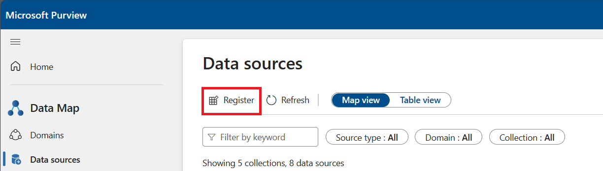
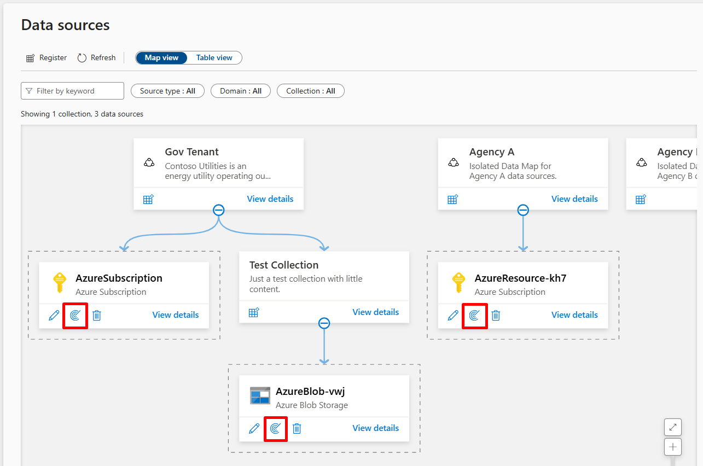
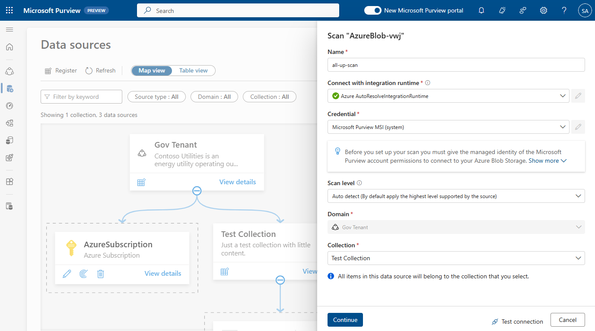
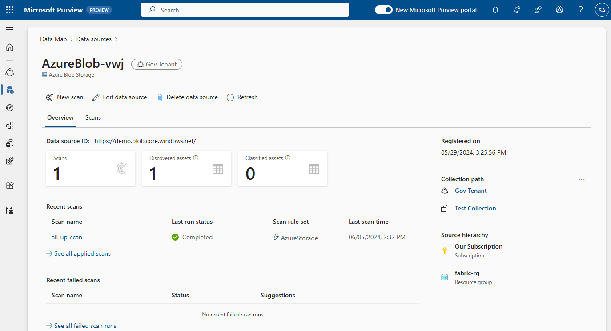
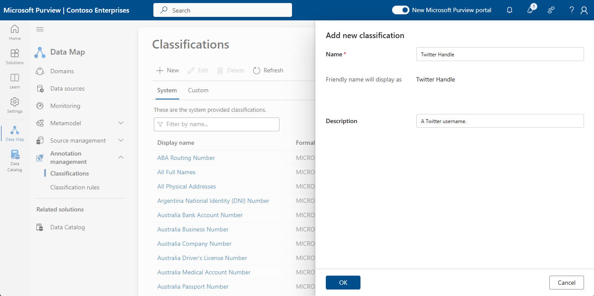
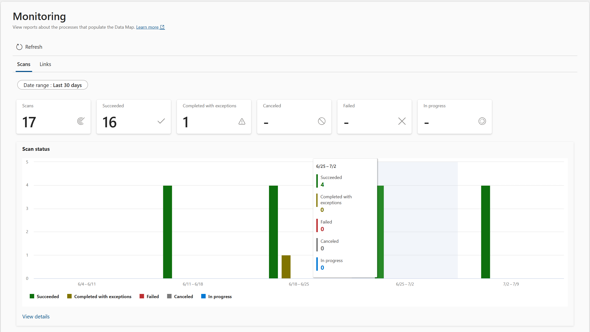
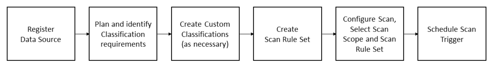

# Lab 3: Managing Data Sources

## Task 1: Registering Data Sources

> Microsoft Purview Solution: Data Map

**⏰ Duration:** 30 minutes

**🎯 Outcome:** At the end of this task you will have registered a series of data sources throughout your business.

### Why register Data Sources?

> Source: [Managing Data Sources](https://learn.microsoft.com/en-us/purview/manage-data-sources)

Microsoft Purview lets you to register, manage, and move data sources in your organization's data map. This aids in the organized categorization and systematic access control of your data.

To register a source, you require the role of a Data Source Admin. The process involves selecting 'Data sources' in the Microsoft Purview Data Map, choosing a source type, and filling out the form on the 'Register sources' page. Note that most data sources have additional specific information and prerequisites for registration and scanning. This may include but is not limited to the configuration of networking-related settings (private endpoints/firewall rules).

As such, data sources are typically registered once by a central IT team or using infrastructure as code (IaC) tools like Terraform or ARM templates. This ensures that the data source is registered consistently across the organization and that the necessary prerequisites are met.

### Exercise: Adding Data Sources

**🫂 Team Activity:** [15 minutes] Review the [supported data sources](https://learn.microsoft.com/en-us/purview/microsoft-purview-connector-overview) and discuss which data sources you would like to onboard first. Start with something that minimizes admin overhead or extensive configuration (think: Azure SQL Database or Azure Data Lake Storage).

- What are the common data sources throughout your organization?
- Is the data source in Azure, another cloud provider, or on premises?
- Do you have any data sources that are not on the supported list? We caution against bespoke integrations.
- Are you looking for a roadmap of upcoming features, including data sources? [Check the roadmap](https://learn.microsoft.com/en-us/purview/whats-new#whats-planned-for-microsoft-purview).

**✍️ Do in Purview:** [15 minutes] Using the Data Map solution, 'Register' a data source by following the wizard. Be sure to select the domain and collection name into which this data source should be registered. You should be confident on your collection hierarchy before continuing.

Once registered, your data map should be populated. Next:

- Navigate to the data source overview and observe the registration date, collection path, source hierarchy.
- Should the data source be enabled for automated data access policy enforcement? (access policies will be set up in subsequent tasks)

**✨ Pro Tip:** Because a data source can only be registered once, in cases where the data source is shared across governance domains, it may make sense to lift it into a parent collection shared by both governance domains. More best practices can be found in the Purview documentation.

After registering your source, you can move it to another collection within the same domain to which you have access. However, it's important to note that when a source moves to a new collection, its scans move with it, but its assets will not appear in the new collection until the next scan is performed.

---

## Task 2: Configure Data Source Scans

> Microsoft Purview Solution: Data Map

**⏰ Duration:** 20 minutes

**🎯 Outcome:** At the end of this tasks, you will have scanned the data source(s) previously registered to let Purview populate the data map with "Data Assets".

### Exercise: Scanning a Data Source

**🫂 Team Activity:** [10 minutes] Remembering that Purview scans metadata and only samples a set number of rows (not the entire database or file), discuss the frequency at which it makes sense to scan each data source.

- How often do data source schemas evolve?
- What data lake layers make sense to be included in a scan? I.e. Do we need to scan raw zones in a data lake when we expect this data to be transformed by business processes prior to becoming "useful" throughout our organization?
- Is it economical to scan a source every day or does it make sense to do so on a weekly/monthly basis given metadata typically doesn't evolve at the same rate as the data itself?
- Do you require scans to occur over a specific runtime? Azure auto-resolved integration runtime vs. self-hosted integration runtime?
- Which credential is required to scan the data source? Microsoft Purview MSI (system) or another?
- What scan level is appropriate for this scan activity?
- Which collection should the assets be scanned into? This may be different from the collection in which the physical data source itself is registered.
- Should scans be full scans or incremental scans?

**✨ Pro Tip:** Don't scan folders of data sources where data is created faster than a data scan can execute (think: files in a raw zone that are created every second). As there is a potential for the data discovery process to endlessly continue before a scan is executed.. leading to cost blowouts or latency.

**✍️ Do in Purview:** [10 minutes] Transfer your discussion into practice by configuring a data source scan for the selected data source.

1. Start by selecting a data source to scan, the select the 'New Scan' button.
   

2. Set up the name, credential, and scan level. Then determine into which collection the data source scan's artifacts (assets) will be written. Follow the steps to provide the Purview MSI its required access to the data source. Test the connection, then proceed.
   

3. The next steps depend on the type of data source but typically require you to select the scope of your scan (ie. which locations in the Storage Account need to be scanned), the types of file extensions to be scanned, the scan rule set to use (we will look at this next), and the frequency of the scan.

Save and run the scan. After a scan is configured, open the Data Source and note the recent scans, each scan has options to trigger the scan manually, edit, or delete it.

**⏸️ Wait:** A data source scan will have to complete before you can move on to the next section. You can use the 'Monitoring' tab of the Data Map or the Scan Details to track scan the scan status.

## Task 3: Defining Scan Rule Sets

> Microsoft Purview Solution: Data Map

**⏰ Duration:** 20 minutes

**🎯 Outcome:** At the end of this task, you will have a better understanding of scan rules ets, how to implement them, and when to use them to optimize data source scanning and reduce cost.

### Understanding Scan Rule sets

> Source: [Creating Scan Rule Sets](https://learn.microsoft.com/en-us/purview/create-a-scan-rule-set)

Microsoft Purview comes with a default Scan Rule set for each data source type. These rule sets are designed to scan the most common file types and metadata. Each scan ingests the metadata and applies a series of classifications to the dataset. Out of the box, there are over 200+ classifications that can be applied, ranging from Government issued IDs (Australian Passport Number, US Social Security Number...), Financial, Personal, Security... to custom classifications that you can define based on the shape of your data.

The default rule set for each data source is a good starting point, but you may want to create custom rule sets to better suit your organization's needs as you learn about your data. For example, you may want to exclude certain file types from a scan or you may want to apply a specific classification to a certain type of data.

As scans consume compute resources, it's important to ensure that your rule sets are optimized to scan only the data that is necessary and only apply the classifications you expect. This will help to reduce costs and improve the performance of your scans. In a practical sense, there is no point analyzing the data source to detect `Argentina National Identity (DNI) Number` if you know for a fact that your data source does not contain information of this type.

**✨ Pro Tip:** You can only use the scan rule set in the domain where you created it.

### Exercise: Creating a Scan Rule set

**🫂 Team Activity:** [10 minutes] Discuss the need for custom scan rule sets in your organization. Consider the following:

- Are there any file types that should be excluded from the scan?
- Are there any classifications that should be applied to specific types of data?
- Are there any classifications that should be excluded from the scan?

**✍️ Do in Purview:** [10 minutes] Create a custom scan rule set for a data source that you have previously scanned. Start by selecting the 'Scan rule sets' tab in the Data Map solution and clocking the 'New' button.

## Task 4: Classifications

> Microsoft Purview Solution: Data Map

**⏰ Duration:** 10 minutes

**🎯 Outcome:** At the end of this task, you will have a better understanding of system and custom classifications in Purview Data Governance, including how to configure them.

### Understanding Classifications

> Source: [Classifications](https://learn.microsoft.com/en-us/purview/concept-classification)

As previously explained, Classifications are applied at the time of scanning, and are used to categorize and label data assets. Microsoft Purview comes with several international system classifications that are scanned for by default, but you can also create custom classifications to more accurately detect and tag data throughout your organization.

**Example:** How asset-level classifications appear for an Azure SQL Table:

**Example:** How schema-level classifications appear for an Azure SQL Table:

#### Custom Classifications

If a bespoke classification does not exist out of the box, you may decide to create a "custom" classification. These may either be regular expression patterns or dictionary lookups. You can further define a percentage of sampled rows that must match the regular expression or dictionary lookup to apply the classification.

An example of a custom classification may be a specifically formatted Invoice ID (e.g. INV-123-XYZ) which needs to be classified as coming from a specific system, or an X (formerly Twitter) handle (e.g. @username).

### Exercise: Creating a Custom Classification

**✍️ Do in Purview:** [10 minutes] Based on your answer to the questions in the previous team activity, go ahead and create the custom classification.

1. In the Data Map solution, navigate to 'Annotation Management' and select 'Classifications'. Click '+ New' and provide a name and description.

   

2. Now we want to associate a classification rule with this classification. Click '+ New' under 'Classification Rules'

   - Provide a name and description for the rule.
   - Next, we need to associate the rule with a our previously created classification.
   - Leave the state as 'Enabled'.
   - Select the type, we will leave it at Regular Expression.

   Select 'Continue'.

3. Now we can go ahead and configure our regular expression. Either do so by following the prompt to upload sample data or supplying your own regex pattern.

   - Specify the Data Pattern.
   - Set the Minimum Match Threshold (the minimum percentage of data value matches in a column that needs to be found by the scanner for the classification to be applied.)
     **✨ Pro Tip:** The suggested value is 60%. Note: If you specify multiple data patterns, this setting will be disabled and the value will be fixed at 60%.
   - You may decide to specify a pattern for the column name as well, this ensures that your rule will only apply to columns with a specific pattern, rather than any column in a dataset.
   - Click 'Create' to confirm your classification rule.

You may decide to revise the Scan Rule Sets from task 3 to include your new classification.

## Task 5: Understanding Integration Runtimes (optional)

> Microsoft Purview Solution: Data Map

**⏰ Duration:** 10 minutes

**🎯 Outcome:** At the end of this task, you will have a better understanding of the different types of integration runtimes available in Microsoft Purview.

### Understanding Integration Runtimes

> Source: [Choose the right integration runtime](https://learn.microsoft.com/en-us/purview/choose-the-right-integration-runtime-configuration)

Microsoft Purview uses integration runtimes (IR) to connect to data sources. These runtimes can be auto-resolved by Azure or self-hosted (SHIR) by your organization. The choice of integration runtime depends on the data source you are connecting to and the network configuration of your organization.

You can choose between:

- **Azure Integration Runtime:** This runtime is managed by Azure and is used to connect to Azure data sources. It is auto-resolved by Azure and does not require any additional configuration.

- **Managed Virtual Network (VNet) Integration Runtime:** This runtime is used to connect to data sources in a virtual network. It is auto-resolved by Azure and does not require any additional configuration.

- **Self-hosted Integration Runtime:** This runtime is hosted on your organization's network and is used to connect to on-premises data sources. It requires additional configuration to connect to your data source.

- **Kubernetes supported Self-Hosted Integration Runtime (Preview):** This runtime is used to connect to on-premises data sources. It requires additional configuration to connect to your data source.

- **AWS Integration Runtime:** This runtime is used to connect to AWS data sources.

Not all data sources support all integration runtime types. You can read more in the documentation linked above.

**✨ Pro Tip:** When choosing an integration runtime, consider the network configuration of your organization and the data source you are connecting to. If you are connecting to an on-premises data source, you will need to use a self-hosted integration runtime.

**🫂 Team Activity:** [10 minutes] Review the integration runtimes available in Microsoft Purview and discuss which runtimes are best suited to your organization's needs.

## Task 6: Monitoring (optional)

> Microsoft Purview Solution: Data Map

Each scan you configure in Microsoft Purview Data Governance has an associated Run ID, which uniquely identifies it. You can view an all-up scan status via the Data Map's Monitoring tab and drill deeper into each category to discover more details.

More Details:

Additional information (including logs) are available.

### Exercise: Monitor your data source scans

**✍️ Do in Purview:** [5 minutes] Spend a few minutes familiarizing yourself with the types of scan statuses and logs available in the Monitoring tab of the Data Map solution.

- Did your data source scan from Task 2 complete successfully? If not, can you find out why?

---

**⏸️ Reflection:** You have now registered data sources, configured scans, and defined scan rule sets in Microsoft Purview. You learned about the concept of classifications and how to create your own classifications for bespoke content. Furthermore, you learned about integration runtimes and how they can be used to connect to data sources.

What does this all mean? You are now ready to build on top of this foundation and start to map data into governance domains.

Each time a data source is onboarded, you will (roughly) follow these steps:

Before you leave, review this section again to understand what is required as your organization connects new data sources or scales Purview across the enterprise.

👉 [Continue: Lab 4](./Lab-04%20-%20Governance%20Domains%20and%20Terms.md)
