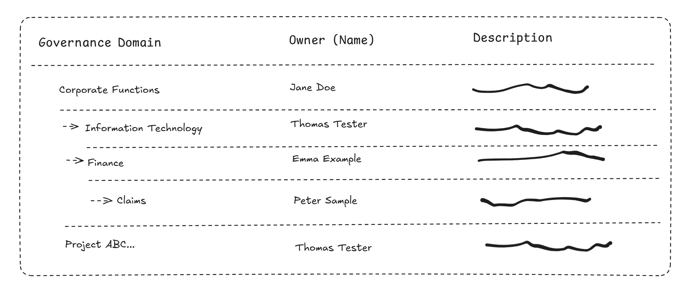

# Lab 4: Governance Domains and Terms

## Task 1: Creating Governance Domains

> Microsoft Purview Solution: Data Catalog

**⏰ Duration:** 20 minutes

**🎯 Outcome:** At the end of this task, you will have conceptualized and created governance domains in Purview.

### Understanding Governance Domains

In Microsoft Purview, a 'governance domain' is a concept introduced to provide context to data assets and enable more effective scaling of data governance practices (in a federated, not centralized approach). Principally focused on improving data ownership management, a governance domain can be seen as a boundary enabling consistent governance, ownership, and discovery of later data products.

**Key Facts**

- A governance domain could represent functional business units, line of business, data domains, regulatory, or project domains for example.
- Governance Domains could also be hierarchical, they can be nested inside parent governance domains. For example: A hypothetical `Customer` domain may contain the `Customer Delivery` and the `Customer Experience` child domains.
- A governance domain has a name, description, domain owner(s), data products, glossary terms, Objectives and Key Results (OKRs) and critical data elements among others.
- Through defining overarching categories for assets, governance domains enable users to narrow down their search for relevant data. They further allow governance domain owners to align data governance to their specific business areas.
- Governance domains aid in managing an expanding catalog of data assets, ensuring effective governance as the data estate grows. Glossary terms defined within a governance domain can be applied to any data product within that governance domain, helping data owners and stewards govern a growing number of assets effectively.
<!-- - Glossary terms now also carry access policies, which get automatically applied when the term is attached to a data product. This means governance domain owners and stewards only need to devise governance practices once, which can then be applied consistently across the data estate. -->

In essence, governance domains utilize existing business context to ensure data is not only more discoverable but also well governed as it expands.

### Exercise: Creating Governance Domains

**🫂 Team Activity:** [20 minutes] Organize yourselves into smaller teams. As a team, discuss and organize business 'domains' within your organization. These may refer to departments / organizational units or other breakdowns of the company.

Use a whiteboard or paper to draw and document your business units.

- Name of the governance domain as it is used throughout the company
- Description of the governance domain and its responsibilities
- Name of the domain Owner(s)
- **Optional:** Discuss the data domain stewards, data product owners, and data quality stewards associated with each governance domain.

At the end of this team exercise, you should have a mind map-like diagram that illustrates the output of your team activity.

Each team will briefly present their design back to the cohort. Once all teams have shared their design, its time to consolidate everything into one master diagram that will be used throughout the exercises. Together, refine the list and note down the type of governance domain.

You will expand on this master diagram as you continue through this course.

**✍️ Do in Purview:** [10 minutes] Using your master diagram, transfer your governance domains, descriptions, owners etc into the Data Catalog solution. You will build on these going forward. You can mark them as 'draft' to avoid them being visible to business users until you are ready to publish.

## Task 2: Map Governance Domains to Data Map Collections

> Microsoft Purview Solution: Data Catalog

**🎯 Outcome:** At the end of this task, you will have scoped your governance domains to a subset of collections from your Data Map.

### Understanding the relationship between Governance Domains and Data Map Collections

Governance Domains may change frequently as your organization evolves or adopts Purview, and thus responsibilities for data assets may shift too. When you map your governance domains to your data map collections, you are creating a link between the business context and the technical data assets.

This link (mapping to Data Map collections) is crucial for ensuring that data assets are managed and governed effectively. By mapping governance domains to Data Map collections, you can ensure that the right people are responsible for, and the right policies applied to, the correct data assets.

**🫂 Team Activity:** [5 minutes] As a group, discuss the relationship between the Data Map's Collections and the Data Catalog's Governance Domains.

- For a given Governance Domain, which collection hierarchies would you expect to be linked?
- What are the key data assets that would be included in this Governance Domain?

**✍️ Do in Purview:** [5 minutes] Perform the required mapping for your governance domains. This will help you to scope the data assets that are relevant to each governance domain during the data curation and discovery phases.

## Task 3: Create Governance Domain Terms (Glossary Terms)

> Microsoft Purview Solution: Data Catalog

**⏰ Duration:** 10 minutes

**🎯 Outcome:** At the end of this task, you will have defined one or more Governance Domain Terms (glossary terms / vocabulary) for your newly created governance domains.

### Understanding Governance Domain Terms

Governance domain terms, or glossary terms, are crucial for managing, governing, and making data discoverable. These terms are more than just a vocabulary for business users; they are related to data assets, categorized. and provide context - greatly simplifying technical jargon associated with your data or industry. Terms play a key role in data governance, helping data stewards to apply policies and scale data governance as the data estate expands.

Data Governance Scalability is achieved by transforming previously static glossary terms (in prior versions of Azure Purview) into active terms containing policies going forward. This change allows automatic application of associated policies every time the term is applied to a data product, hence ensuring security and discoverability while offloading the burden from data stewards.

**Key Facts**

- **Terms** are grouped under their respective Governance Domains as to provide context for each segment of your company, hence aiding the team to differentiate between the meanings if ever a term is shared across different domains.

- **Policies** attached to the terms provide specific business health goals, data governance requirements, and terms of use to any data product that the term is applied to.

- **Custom Attributes** can be added to the glossary terms to provide more information, and they can be edited, updated or removed as per business requirements.

- **Publishing** a Term makes it visible to all users, this step needs to be performed once the term is ready to be used within the Governance domain.

- **Linking Data Products** to Terms is a feature that allows glossary terms to become more contextual and accurate to their governance domain.

- **Related Terms** provide better business context and can be managed from the glossary term page. They can be added as a synonym or a related term and can be removed when necessary.

### Exercise: Creating Governance Domains Terms

**🫂 Team Activity:** [5 minutes] Discuss how your organization handles acronyms and word dictionaries today.

- Where do new starters go to get familiar with your glossary today?
- Do you have one or more large spreadsheet(s) of terminology?
- Are you using a SharePoint site to let users discover business terms?
- How beneficial would it be to co-locate the business glossary with the data governance tooling

**✍️ Do in Purview:** [5 minutes] Create new terms for Governance Domains of your choosing and note the 'steward' and 'expert' fields where you can assign a respective colleague.

**✨ Pro Tip:** Try out the new Copilot integration to generate industry-relevant terms.  
**✨ Pro Tip:** Try out the new Term Policies features.  
**✨ Pro Tip:** You may like to use a free third-party tool like [Macula Purview Automate](https://www.maculasys.com/microsoft-purview) to load existing spreadsheets of terms into Purview in bulk. Seek advice from your Microsoft contact or partner for more information.

## Task 4: Browse the Enterprise Glossary

> Microsoft Purview Solution: Data Catalog

**⏰ Duration:** 5 minutes

**🎯 Outcome:** At the end of this task, you have verified the term discovery experience using the Enterprise Glossary.

### Exercise: Browsing the Enterprise Glossary

Now that you have created governance domains and terms, it's time to explore the Enterprise Glossary in Purview. This is the experience presented to business users to help them discover and understand the terms you just created.

Please note that in order for a term to be visible to business users via the Enterprise Glossary, the term as well as the governance domain owning the term must be published.

**👉 Do in Purview:** [5 minutes] Navigate to the Enterprise Glossary in Purview and explore the terms you have created.

- Note that the term hierarchy is nicely presented as expected, appropriate information provided, and the published state of the term is reflected.
- When the term is moved to draft, the change should be reflected in the Enterprise Glossary.
- When the entire Governance Domain is moved to draft, all terms associated with it should be hidden from the Enterprise Glossary.

---

**⏸️ Reflection:** At this point you have implemented one or more governance domains and articulated the value of business concepts over your physical data estate to assist in data governance. You have also created glossary terms to provide context to your data assets. Ready to move on?

👉 [Continue: Lab 5](./Lab-05%20-%20Curating%20Data%20Assets.md)
