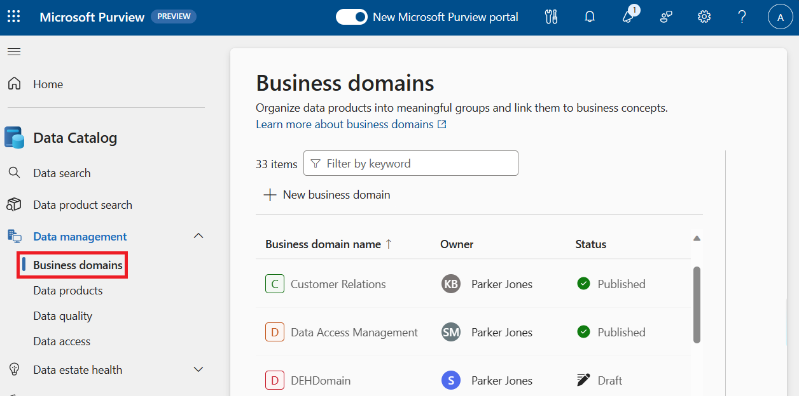
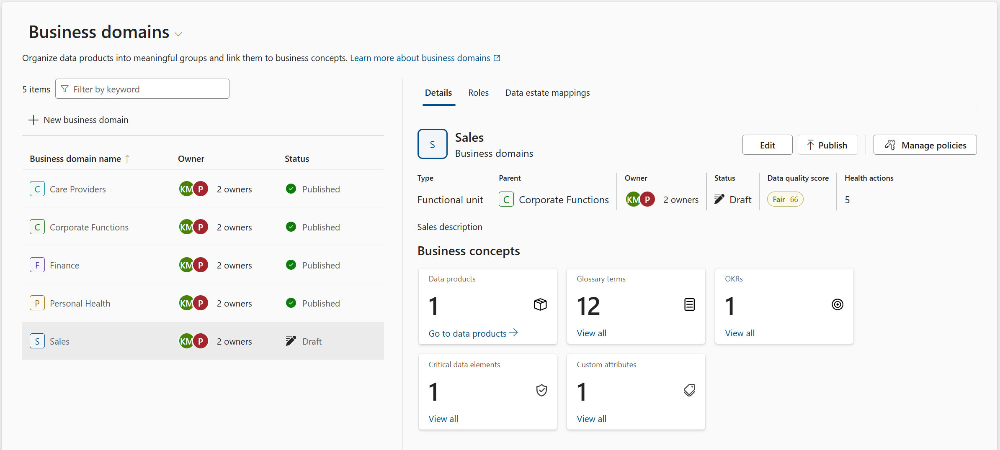

# Lab 4: Business Domains

## Task 1: Creating Business Domains

**⏰ Duration:** 20 minutes

**🎯 Outcome:** At the end of this task, you will have conceptualised and created business domains in Purview.

### Understanding Business Domains

In Microsoft Purview, a 'business domain' is a new concept introduced to provide context to data assets and enable more effective scaling of data governance practices (in a federated, not centralized approach). Principally focused on improving data ownership management, a business domain can be seen as a boundary enabling consistent governance, ownership, and discovery of data products.

**Key Facts**

- A business domain could represent functional business units, line of business, data domains, regulatory, or project domains for example.
- Business Domains could also be hierarchical, they can be nested inside parent business domains. For example: A hypothetical `Customer` domain may contain the `Customer Delivery` and the `Customer Experience` child domains.
- A business domain has a name, description, domain owner(s), data products, glossary terms, Objectives and Key Results (OKRs) and critical data elements among others.
- Through defining overarching categories for assets, business domains enable users to narrow down their search for relevant data. They further allow business domain owners to align data governance to their specific business areas.
- Business domains aid in managing an expanding catalog of data assets, ensuring effective governance as the data estate grows. Glossary terms defined within a business domain can be applied to any data product within that business domain, helping data owners and stewards govern a growing number of assets effectively.
<!-- - Glossary terms now also carry access policies, which get automatically applied when the term is attached to a data product. This means business domain owners and stewards only need to devise governance practices once, which can then be applied consistently across the data estate. -->

In essence, business domains utilize existing business context to ensure data is not only more discoverable but also well governed as it expands.

### Excersise: Creating Business Domains

**🫂 Team Activity:** [20 minutes] Organize yourselves into smaller teams. As a team, discuss and organize business 'domains' within your organization. These may refer to departments / organizational units or other breakdowns of the company.

Use a whiteboard or paper to draw and document your business units.

- Name of the business domain as it is used throughout the company
- Description of the business domain and its responsibilities
- Name of the domain Owner(s)
- **Optional:** Discuss the data domain stewards, data product owners, and data quality stewards associated with each business domain.

At the end of this team exercise, you should have a mind map-like diagram that illustrates the output of your team activity.

Each team will briefly present their design back to the cohort. Once all teams have shared their design, its time to consolidate everything into one master diagram that will be used throughout the exercises.

You will expand on this master diagram as you continue through this course

**✍️ Do in Purview:** [10 minutes] Using your master diagram, transfer your business domains, descriptions, owners etc into the Purview Data Governance Portal. You will build on these going forward. You can mark them as 'draft' and notice how the results will be hidden from the search results.
