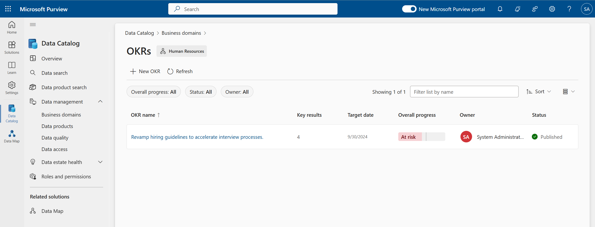

# Lab 7: Objectives and Key Results (OKRs)

## Task 1: Creating OKRs

> Microsoft Purview Solution: Data Catalog

**⏰ Duration:** 20 minutes

**🎯 Outcome:** At the end of this task, you will have linked data products created in [Lab 5](/Lab-05.md) to [OKRs](https://learn.microsoft.com/purview/what-is-data-catalog#okrs) in your [Governance domains](https://learn.microsoft.com/purview/what-is-data-catalog#governance-domains). This will attach trackable business-focused metrics to those domains and the Data products attached.

### Understanding Objectives and Key Results (OKRs)

Within Purview, Objectives and Key Results ([OKRs](https://learn.microsoft.com/purview/concept-okr)) is the goal or desired outcome of a Governance domain. The purpose of OKRs is to connect the objectives of a company or team to measurable business outcome. i.e. a 10% raise in sales, or a 3% reduction in support cases.

Purview's OKRs have several attributes:
- Owners - the users responsible for maintenance of the objective. These are typically Business leaders with an understanding of how the business functions and where it's headed
- Definition - An overarching description of your objective, which can be as broad as “empower every person and every organization on the planet to achieve more”, or as specific as "use marketing campaigns to increase sales in the first quarter."
  - ***NB*** - Good objectives are specific and achievable in a time frame.

- Target date - when you expect to achieve your goal.
- Key results - these are the measurable, time-bound metrics associated with your objective, and should be how you track progress toward your objective.
  - A good metric is SMART = **S**pecific, **M**easurable, **A**chievable, **R**ealistic, and **T**imebound.  
 

**Why do we bring OKRs into a Data Governance Solution?** Imagine you're a data scientist in an IT division, tasked with helping the sales unit improve its customer retention rate. 

You likely have little or no idea which domain-specific data assets are available, because you don't usually interact with the sales team and even less so, have an understanding of the key business processes or which data sets support these. That's where OKRs shine! By linking Data products to objectives, you empower users to easily find the data sets that directly influence or are most relevant to the business objective. 

This is especially useful in large organizations where data assets are spread across multiple business units and teams may be required to collaborate across departments. 

**✨ Pro Tip:** When used with the Purview Copilot ([licence dependant](https://learn.microsoft.com/purview/copilot-in-purview-overview)) experience, the additional context which OKRs and linked Data Products provide, can greatly improve the search experience for end users.

Here is an example of a OKR for a Human Resources Data product. Note, the ubiquitous business language used, and the four linked, measurable objectives, and the visual progress indicator against each metric. 

### Exercise: Creating an OKR

**🫂 Team Activity:** [10 minutes] Choose a governance domain and discuss what this business unit is measured on, what they "care" about.

- Are there any executive mandates or strategic initiatives that are top of mind?
- Can you identify any metrics that are tracked to measure success in this domain?
- What are the key results that would indicate success in this domain?
- Who owns the objectives that the business area is working towards?

**✍️ Do in Purview:** [5 minutes]

- Using the 'New OKR' option in a governance domain of your choice, add the name, owners, and target date.
- Once the OKR is created, open it up and add a key result to create the measures that feed this objective.
- You can also explore the 'Link data product' option if you have data products that you created in the previous Lab which relate to this objective. Data products need to be published before they can be linked.
- Note the Status option. The objective is in Draft until you select 'Publish'.

The back on the governance domain's OKR overview page, you can now see the objective and key results that have been created. You can also see the overall progress of the OKR. This is calculated based on the average of the progress of the key results.

---

**⏸️ Reflection:** Now that you have seen how Purview's implementation of OKRs can be used to link business objectives to Data products. How do you think this will help your organization? What are some of the challenges you foresee in maintaining these links as the business evolves?

👉 [Continue: Lab 8](./Lab-08%20-%20Health%20Management%20Controls.md)
