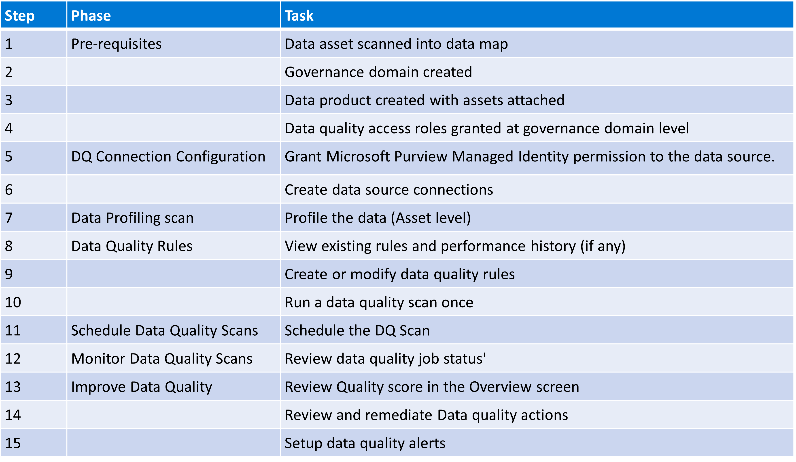
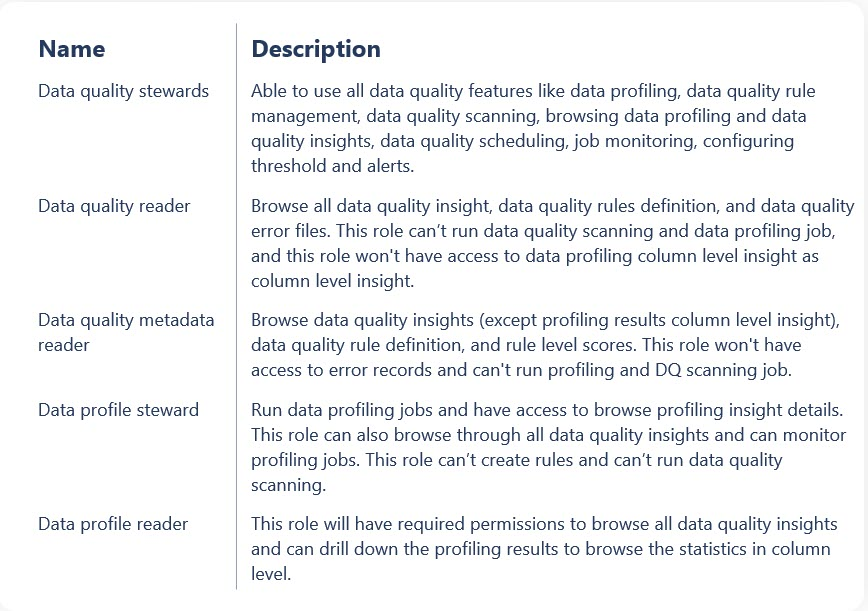
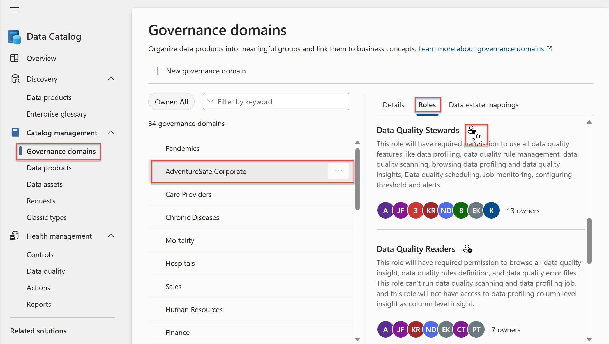
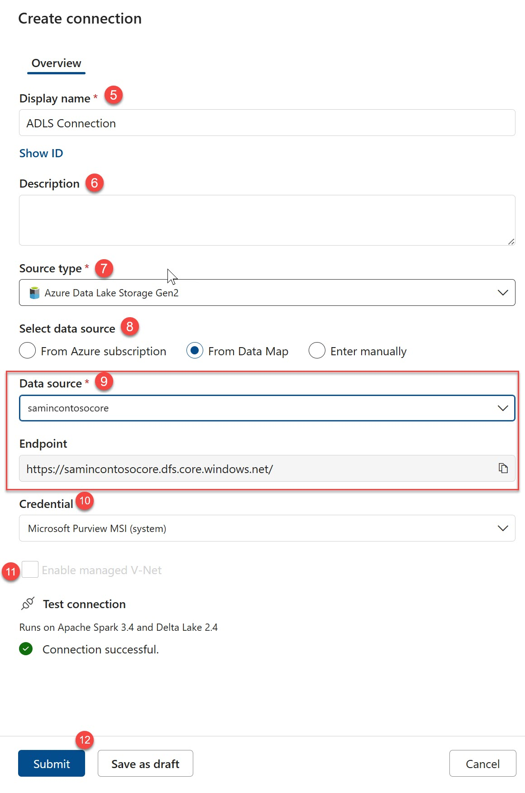
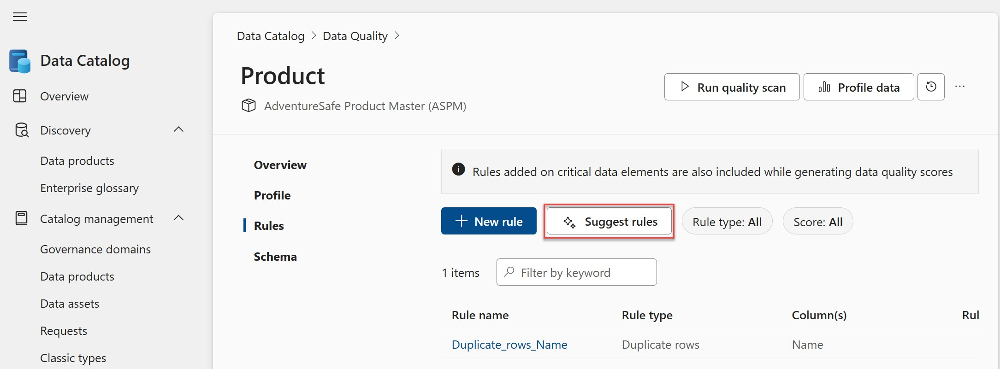
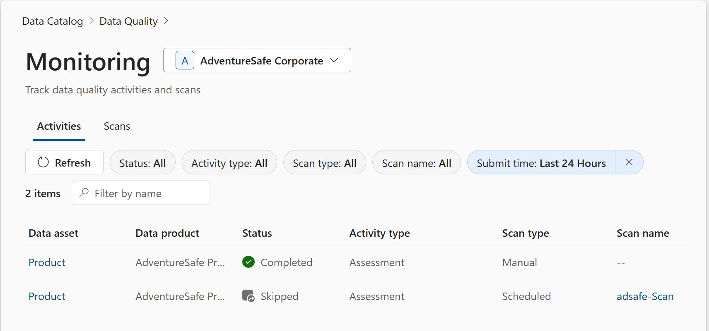
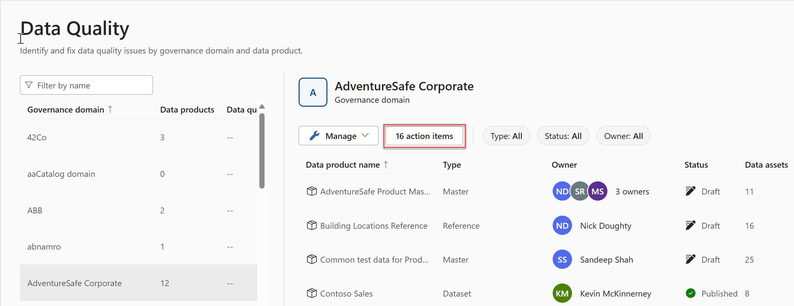
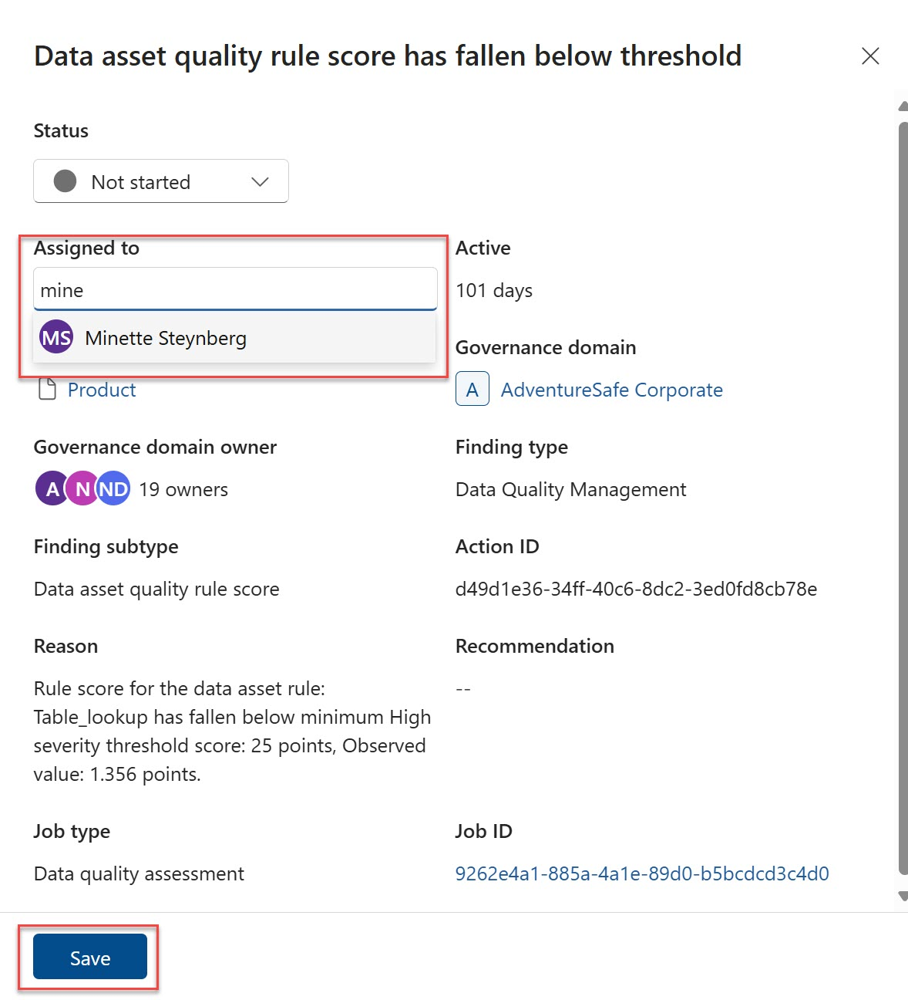

# Lab 9: Data Quality Management

## Task 1: Introduction to Data Quality

> Microsoft Purview Solution: Data Catalog

**⏰ Duration:** 20 minutes

**🎯 Outcome:** At the end of this task, you will have an understanding of:

- the importance of data quality in data governance,
- the Purview Data quality life cycle.

### Importance of Data Quality in Data Governance

In the context of data governance, data quality is the foundation of data management. It ensures that data is accurate, complete, and reliable. Data quality is essential for making informed decisions, ensuring compliance with regulations, and driving business value.

Data is the pulse of any business, and data quality is the heartbeat. Poor data quality can lead to costly mistakes, missed opportunities, and reputational damage. It can also undermine trust in data-driven decision-making processes.

Data quality is a shared responsibility that requires collaboration between business and IT stakeholders. It involves defining data quality standards, profiling data, monitoring data quality metrics, and taking corrective actions when data quality issues are identified.

Microsoft Purview Data Quality is a tool which supports a well defined process to ensure data quality is monitored and maintained.

### Multi-cloud Data Quality Management in Purview

Data Quality in Microsoft Purview is a feature that allows you to manage, and monitor data quality across multi-cloud data sources by leveraging the power of shortcuts in Microsoft Fabric.
Fabric OneLake serves as a single, unified data lake for the entire organization, allowing data from various sources to be processed without duplication.

OneLake shortcuts enable referencing data stored in different locations, making it appear as if it’s stored locally, facilitating data combination across different business groups.

Leveraging the shortcuts to reference data in OneLake, Purview Data Quality can scan data from multiple sources, including Azure Data Lake Storage Gen2, Amazon S3, and Google Cloud Storage, without moving the data. This allows you to monitor data quality across multi-cloud data sources without the need to move data to a single location.

In this section we will look at the process for setting up Microsoft Purview Data Quality scans, creating and managing data quality rules, and monitoring and improving data quality on an ongoing basis.

### The Data Quality Checklist

This is a checklist of all the tasks that need to be done to get the data quality process up and running. More in depth details of each task will be covered in the following sections.

## Task 2: Pre-requisites (Step 1 to 4)

Before you can start using Microsoft Purview Data Quality, you need to ensure that you have the following pre-requisites in place:

Step 1: Data assets have been scanned into the Purview Data Map [Review Lab 3: Managing Data Sources](./Lab-03%20-%20Managing%20Data%20Sources.md)

Step 2: The relevant governance domains have been defined [Review Lab 4: Governance Domains and Terms](./Lab-04%20-%20Governance%20Domains%20and%20Terms.md)

Step 3: Data products have been created [Review Lab 5: Data Products](./Lab-05%20-%20Data%20Products.md)

Step 4: Required access has been granted at the Governance Domain level:

To assign permissions to a user or group, follow these steps:

- Under Catalog management in the Purview Studio, select the Governance domains sub-menu.
- Select the domain that you want to assign permissions to.
- Click on the Roles tab.
- Find the relevant role and click on the Add button.
- Enter the user or group name and click save.

## Task 3: Data Quality Connection Configuration (Step 5 to 6)

> Microsoft Purview Solution: Data Catalog

**⏰ Duration:** 20 minutes

**🎯 Outcome:** At the end of this task, you will have configured a data quality scan connection.

#### Configuring Data Quality Scan Connections

The data source connections for Data Quality will be configured at a Governance domain level. This is a separate configuration to the data source connections for the Data Map, because unlike the Data Map scans, the Data Quality will perform a deep scan which means that it will scan all the selected data in the data source and not just the metadata or a sample of the data.

Step 5: Grant access to the Purview Managed Identity to the data source
Data Quality scanning currently only supports Managed Identity (MSI) authentication. You will need to ensure that the MSI has the required permissions to access the data source. Follow these instructions to [grant permissions to the MSI](https://learn.microsoft.com/en-us/purview/register-scan-adls-gen2?tabs=MI#authentication-for-a-scan)

Step 6: Create a Data Quality Scan Connection

**✍️ Do in Purview:**
To configure the data source connections for Data Quality, follow the steps below:

1. Select the Data Quality sub-menu under Health management from the left hand menu in the Purview Studio.
2. Select the Governance domain that you want to configure the data source connections for.
3. Click on the Manage button and select Connections from the drop down menu. This will open the Connections screen.
4. Click on the New button to open the Create connection panel.
5. Add a display name
6. Add a description
7. Select the data source type from the drop down list
   See a list of supported data sources [here](https://learn.microsoft.com/en-us/purview/how-to-configure-and-run-data-quality-scan#supported-data-source-types).

8. Choose how you will add the data source. You can choose to add the data source from:
   - Your Azure subscription
   - From the Data Map or
   - Manually
9. Enter the relevant details for the selected data source type. If you selected Fabric as the data source type, you will need to provide your Fabric Tenant ID. This will allow you to run data quality scans on shortcuts to other cloud sources.
10. Enable a managed V-Net if required. This will require you to select a compute or prompt you to create one.
11. MSI (Managed Service Identity) is currently the only supported authentication method. You will need to ensure that the MSI has the required permissions to access the data source. Follow these instructions to [grant permissions to the MSI](https://learn.microsoft.com/en-us/purview/register-scan-adls-gen2?tabs=MI#using-a-system-or-user-assigned-managed-identity-for-scanning.)
12. Click Submit to save the connection.
    

## Task 3: Configure and Run Profiling (Step 7)

> Microsoft Purview Solution: Data Catalog

**⏰ Duration:** 20 minutes

**🎯 Outcome:** At the end of this task you would have configured and run data profiling.

### Purpose of Profiling

Before creating data quality rules it is helpful to get an indication of the quality of the data. Profiling is the process of analyzing data to identify patterns, anomalies, and inconsistencies. Profiling helps to understand the structure and quality of the data, which is essential for creating data quality rules.

Profiling is done at the asset level and returns statistical measures depending on the data type of each column. Profiling is only run as a once-off scan when triggered by the user by clicking on the profile data button.

Basic data quality metrics are returned as part of the profiling process. These include:

- Unique values
- Empty/Blank values
- Duplicate values

**✍️ Do in Purview:**

Follow the steps in the following tutorial to configure and run profiling: [Configure and run profiling](https://learn.microsoft.com/en-us/purview/how-to-configure-and-run-data-profiling#steps-to-configure-data-profiling-job)

## Task 4: Creating and Managing Data Quality Rules (Step 8 to 10)

> Microsoft Purview Solution: Data Catalog

**⏰ Duration:** 20 minutes

**🎯 Outcome:** At the end of this task, you will have...

- Understood the different types of data quality rules in Purview
- View and/or created No-code/low-code data quality rules
- Run a data quality scan once

### Different Types of Data Quality Rules

Microsoft Purview currently supports the following types of data quality rules:

- [Freshness](https://learn.microsoft.com/en-us/purview/concepts-data-quality-rules#freshness)
  This type of rule determines if a data asset has been updated within a specified time frame. Freshness rules are useful for monitoring data that needs to be updated regularly, such as sales data or financial reports. Freshness rules will have a score of either 100 (pass) or 0 (fail).

- [Uniqueness](https://learn.microsoft.com/en-us/purview/concepts-data-quality-rules#unique-values)
  This checks if a specified record is unique or not and will have a score of either 100 (pass) or 0 (fail).

- [String format match](https://learn.microsoft.com/en-us/purview/concepts-data-quality-rules#string-format-match) This rule checks if the value in the column matches a pre-defined string format. See the section on understanding data quality scores for more information on how the score is calculated.

- [Data type match](https://learn.microsoft.com/en-us/purview/concepts-data-quality-rules#data-type-match) This rule checks if the data type of the column matches the expected data type. See the section on understanding data quality scores for more information on how the score is calculated.

- [Duplicate rows](https://learn.microsoft.com/en-us/purview/concepts-data-quality-rules#duplicate-rows) This rule checks if there are rows with the same values across the specified columns.

- [Empty/blank fields](https://learn.microsoft.com/en-us/purview/concepts-data-quality-rules#emptyblank-fields) This rule checks if there are any empty, blank or null value fields in the specified column.

- [Table lookup](https://learn.microsoft.com/en-us/purview/concepts-data-quality-rules#table-lookup) This rule checks if the value in the column exists in a lookup table. The lookup table can be any other scanned data asset.

- [Custom rules](https://learn.microsoft.com/en-us/purview/concepts-data-quality-rules#custom-rules) Custom rules are defined using Azure Data Factory expression language.

Data quality rules are configured at the asset level to include one or more columns.
Purview has an AI powered rule recommendation engine that will suggest rules based on the data profile. You can get suggestions for rules by clicking on the Suggest rules button.

**✨ Pro Tip:**
Carefully review rules suggested by the Copilot and ensure that they are relevant to the data asset, data quality scans are a compute intensive process and you don't want to run unnecessary scans.

**✍️ Do in Purview:**
Go ahead and create a couple of data quality rules using the instructions in the links above for each rule type.

## Task 5: Schedule Data Quality Scans (Step 11)

> Microsoft Purview Solution: Data Catalog

**⏰ Duration:** 10 minutes

**🎯 Outcome:** At the end of this task, you will know how to schedule a data quality scan to run on a regular basis.

Scans can be scheduled to run at regular intervals, this will allow you to build up a history of the data quality of the asset over time.
A data sources needs to have been registered for data quality scanning as covered in step 5 and 6.

The scan schedule is created at a Governance domain level and can be scoped to run for any or all data products within the domain. Be sure to have configured the data quality rules before scheduling the scan, scans without rules will simply be skipped.

**✍️ Do in Purview:**

Follow the steps in the following tutorial to schedule a data quality scan: [Schedule a data quality scan](https://learn.microsoft.com/en-us/purview/how-to-configure-and-run-data-quality-scan#schedule-data-quality-scans)

## Task 6: Monitor Data Quality Scans (Step 12)

> Microsoft Purview Solution: Data Catalog

**⏰ Duration:** 10 minutes

**🎯 Outcome:** At the end of this task, you will know how to monitor data quality scans.
You will be able to monitor the status of any data quality or profiling scans that have been run or are currently running.

To do this, you will need to navigate to the Data Quality sub-menu under Health management in the Purview Studio.

- Select the Governance domain that you want to monitor the scans for.
- Click on the Manage button and select Monitoring from the drop down menu. This will open the Monitoring screen.
- Here you will see a list of all scanning activities that have been run, including profiling or ad-hoc scans. The Scans tab will show a list of scheduled scans.

This screen defaults to the Governance domain you clicked on but provides a drop down for you to easily switch to other domains you have access to.

**✨ Pro Tip:** The Data quality scanning has functionality to check if there has been changes since the last scan. If no changes has been detected the scan will be skipped. Skipped merely means there has been no changes in the data since last run and the data quality check will not be performed. Skipped does not mean Failed!

## Task 7: Improve Data Quality (Step 13 to 15)

> Microsoft Purview Solution: Data Catalog

**⏰ Duration:** 20 minutes

**🎯 Outcome:** At the end of this task, you will know how to review your data quality scores, review and remediate data quality actions and how to set up data quality alerts.

### Step 13: Review Data Quality Scores

The purpose of the data quality score is to provide a high-level view of the quality of the data. The score is calculated based on the rules that have been configured for the asset. The score is a percentage and is calculated based on the number of rules that have passed or failed.

The scores are rolled up into a column score, which is the average of all the rules on that column. The column score is then rolled up into an asset score, which is the average of all the column scores.

Asset level scores are rolled up into the Global score which is the average of all the asset scores in the governance domain.

Inactive or draft rules will not be included in the score calculation.
You can get more information on how exactly the score is calculated [here](https://learn.microsoft.com/en-us/purview/how-to-view-data-quality-scan-results)

### Step 14: Review and Remediate Data Quality with Actions

Improving the quality of your data is an ongoing process. When Purview identifies data quality issues, it will automatically create actions for you to review and remediate.

You will be able to see the number of actions items identified at the Governance domain level.

Clicking on the Action Items button will take you to the list of action items identified for that Governance domain. Action items are not automatically assigned to anyone, you will need to assign the action to a user or group.

**✍️ Do in Purview:**

To assign a Data Quality action to a user or group, follow these steps:

- Click on the Action Items button to open the list of action items.
- Click on the action item that you want to assign. This will open the action details screen which will show detailed information about the finding, the reason for the finding and a recommendation on how to remediate the finding.
- Start typing the name of the user or group that you want to assign the action to, and then select it from the list of suggestions.
- Click on the Save button to assign the action.

To see actions that are assigned to you, click on the My item tab in the actions list.This will show you all the actions that are assigned to you. You can then click on the action to view the details and take the necessary steps to remediate the issue.

**✨ Pro Tip:** Data Quality actions are not the same as Health actions. Health actions and Data Quality actions are 2 separate list of actions which requires different permissions to view and manage. Learn more about Health actions in [Lab 11: Data Estate Health Actions](./Lab-11%20-%20Data%20Estate%20Health%20Actions.md)

### Step 15: Set up Data Quality Alerts

Data quality alerts can be set up to notify you when the quality of the data falls below a certain threshold. Alerts can be set up at the Governance domain level and can be configured to send an email notification to a user or group when the data quality score falls below a certain threshold. Alerts can also be configured to send a notification when if a data quality scan fails.

**✍️ Do in Purview:**

Follow the steps in this tutorial to set up a data quality alert: [Set up a data quality alert](https://learn.microsoft.com/en-us/purview/how-to-data-quality-notifications#set-data-quality-alerts)

👉 [Continue: Lab 10](./Lab-10%20-%20Health%20Management%20Actions.md)
