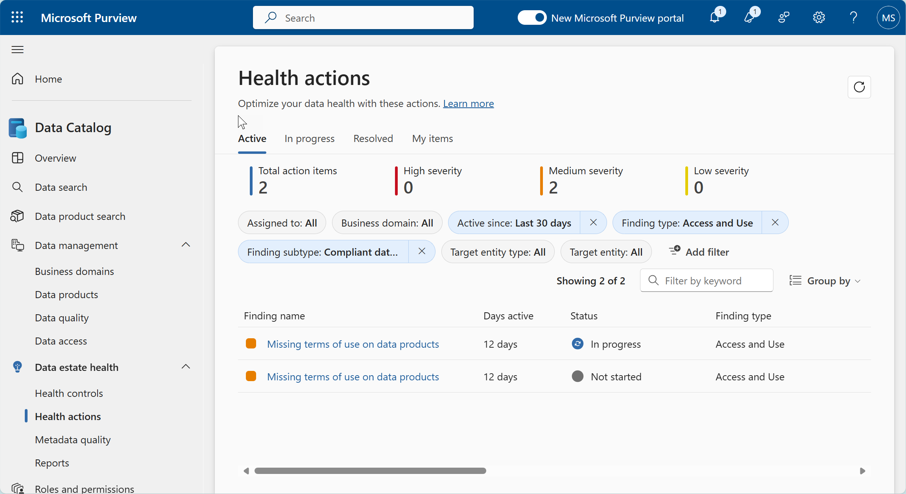
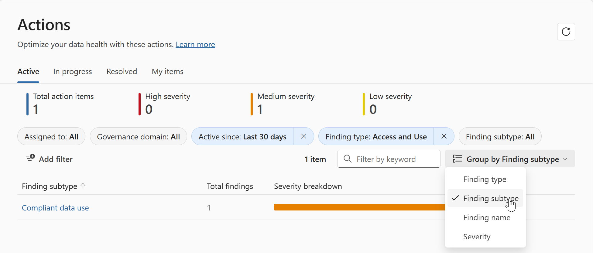
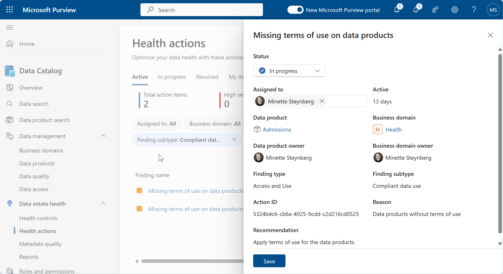

# Lab 10: Data Estate Health Actions

**⏰ Duration:** 30 minutes

**🎯 Outcome:** At the end of this lab you will understand how to use Data Estate Health Actions to improve the overall health score of your data estate.

## Introduction

In the section on Health Management Controls and Data Quality Management, we looked at how to configure the rules that determine the quality score of each of your health controls. In this section we will focus on the Data Estate Health Actions and how to use these to improve the overall health score of your data estate.

Purview's Health Actions correspond to the checks made to calculate a data product's Health Control score. Addressing these actions raises your health score and promotes an overall more useable and discoverable data catalog. 
   - Health Controls were covered off in [Lab 08](./Lab-08%20-%20Health%20Management%20Controls.md).

Actions can be assigned to individuals or teams and tracked to completion.

**Permission Requirement:**

- You need at least [Data Health Reader](https://learn.microsoft.com/purview/governance-roles-permissions#governance-domain-level-permission:~:text=read%2C%20datahealth/write-,Data%20health%20reader,-Can%20read%20artifacts) permissions to be able to view Health Management Actions.
- You need at least [Data Health Owner](https://learn.microsoft.com/purview/governance-roles-permissions#governance-domain-level-permission:~:text=dataaccess/glossarytermpolicy/read-,Data%20health%20owner,-Create%2C%20update%2C%20and) permissions to be able to update Health Management Actions.

## Task 1: Understand the Health Management Dashboard

> Microsoft Purview Solution: Data Catalog

**⏰ Duration:** 15 minutes

**🎯 Outcome:** At the end of this task, you will understand how to use Health Actions to address the findings of the Health Control rules, and uplift data estate health.

### How are health actions determined?

Health Actions are automatically created when a scheduled Health Control executes and it's rule thresholds are not met. 

Each Health Action has a severity classification assigned, based upon Health Control rule configuration. The available severity values are High, Medium, and Low. 

### The Health Actions Dashboard

The Health Actions dashboard gives you an overview of the Health Actions that have been created based on the Health Control rules that have been defined. 

❗- By default, Health Actions are not assigned to anyone. They must be assigned to a user/group, so that can be actioned. If left, they simply remain in the system and visible on the dashboard, unresolved. 

The Health Actions Dashboard shows four tabs:

- Active: This shows new actions and actions which are currently in progress.
- In Progress: A list of actions with a status of In Progress.
- Resolved: A list of actions that have been resolved.
- My Items: Items assigned to you.

**✍️ Do in Purview:** [15 minutes] Using the Health Actions tool, review the active Health Actions, assign an action to a user and update the action's status to In Progress.

Health actions can be filtered by the following criteria:

- Assigned user.
- Governance domain.
- Severity.
- Days open.
- Finding type, name and subtype.
- Target entity type i.e. Governance domain, Data product, data asset etc.

1. Click on the Active tab to view the active Health Actions. This may vary slightly depending on how the findings are grouped. In the screenshot, the findings are grouped by Finding type.
2. To change the grouping of the findings, click on the 'Group by' drop-down and select the grouping you would like to use. 

3. To view the details of an action, click on one of the findings in the list. This will bring up the Finding screen which displays the action's details.
   
4. Assign the Health Action to a user by clicking in the 'Assigned to' field and selecting a user from the list.
5. Set the status of the Health Action to In progress by clicking on the 'Status' field, and selecting "in progress" from the list of options.
   - ***NB*** - This is typically not an action you would do if you were assigning the action to someone else, as the action assignee would be responsible for updating the status.
7. Click on the Save button to complete the assignment and status update.

**✨ Pro Tip:** Actions that have been marked as Resolved will be reconciled when the next scan runs. If an action has incorrectly marked as resolved or not correctly mitigated the action will be reset too active.

---

**⏸️ Reflection:** You just learnt how to use the Health Actions tool to manage the actions required to improve the health of your data estate. Now let's have a word about Business Continuity and Disaster Recovery.

👉 [Continue: Lab 11](./Lab-11%20-%20Business%20Continuity.md)
