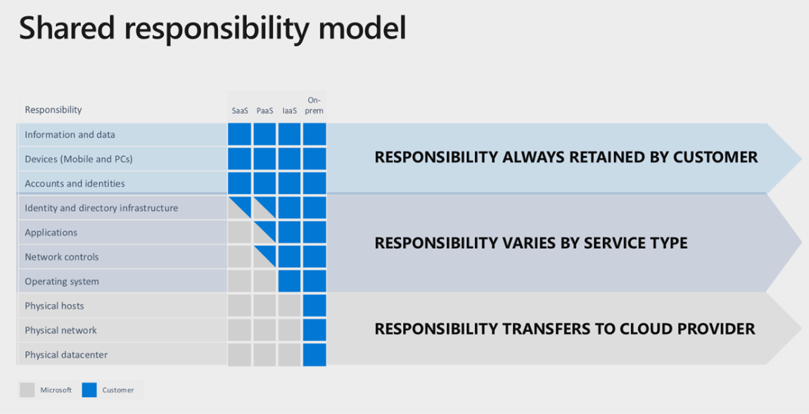

# Lab 12: Business Continuity and Disaster Recovery

## Task 1: Understand your Responsibilities

**⏰ Duration:** 15 minutes

**🎯 Outcome:** At the end of this task, you will have understood your backup/restore, and [disaster recovery](https://learn.microsoft.com/azure/reliability/disaster-recovery-overview) choices and responsibilities.

### What is the SLA for Microsoft Purview?

At the time of writing, Microsoft Purview as a [SaaS](https://azure.microsoft.com/resources/cloud-computing-dictionary/what-is-saas/?msockid=2114a70960fe65991122b5c4618d6462) service, has a **99.9%** uptime Service Level Agreement (SLA). This SLA is based on the Monthly Uptime Percentage formula.

**✨ Pro Tip:** This is a financial guarantee of service. 99.9% (three nines) equates to no more than ~8.76 hours of downtime per year.

If Microsoft fails to meet this guarantee, you may be eligible for service credits. For more information, including the uptime calculation, please refer to the [Microsoft SLA page](https://www.microsoft.com/licensing/docs/view/Service-Level-Agreements-SLA-for-Online-Services).

### A word on Business Continuity and Disaster Recovery (BCDR)...

Business continuity refers to the processes and strategies implemented to ensure that a solution continues to function effectively in the event of disruptions, such as system failures, natural disasters, or other unexpected incidents. The goal is to minimize downtime, maintain critical business operations, and reduce the impact on the organization's productivity and revenue.

A sub-component of Business continuity is Disaster Recovery (DR), which Microsoft defines as "recovering from high-impact events, such as natural disasters or failed deployments, that result in downtime and data loss." - [source](https://learn.microsoft.com/azure/reliability/disaster-recovery-overview).

**✨ Pro Tip:** Microsoft provides strong guidance for [designing a disaster recovery strategy](https://learn.microsoft.com/azure/well-architected/reliability/disaster-recovery), along with a detailed example for an [Azure Data Platform](https://learn.microsoft.com/azure/architecture/data-guide/disaster-recovery/dr-for-azure-data-platform-overview).

Classic Purview Data Governance has limited [DR capabilities](https://learn.microsoft.com/purview/disaster-recovery), requiring a second deployment, supported by customised API development, and [acknowledged limitations](https://learn.microsoft.com/purview/disaster-recovery#limitations-and-considerations).

As at Oct 2024, the DR capability for the New Experience SaaS offering is yet to be defined. The expectation is that it will follow the Microsoft - [Shared responsibility model](https://learn.microsoft.com/azure/reliability/business-continuity-management-program#shared-responsibility-model), for which the customer retains the responsibility to ensure the accounts, identities, and data is correct/up-to-date.

**🫂 Team Activity:** [10 minutes] Discuss to what extend Purview is considered critical to your business operations. i.e. if Purview is offline, what business processes are impacted?

In most cases, an organization wouldn't deem their internal data governance tooling mission critical - but your company's use case, customization, and level of integration may differ.

- Have you documented the [recovery point/time objectives](https://learn.microsoft.com/azure/reliability/disaster-recovery-overview#recovery-objectives)? What are they?
- What happens if someone accidentally deletes the Microsoft Purview Azure resource or defaults on your company's Azure subscription payment?
- Do you know your Purview account creator? document their name and details. There can only be one creator, and you can only transfer this role to another staff member by filling out an Azure Support ticket.
- Have you implemented a '[break-glass](https://learn.microsoft.com/purview/concept-best-practices-security#implement-a-break-glass-strategy)' strategy to gain emergency admin access to your Microsoft Purview account?

**✍️ Do in Purview:** [5 minutes] As with any Azure service, there are several recommended steps to undertake that ensure your resources are more resilient.

- Navigate to the Purview Azure resource and open its properties. From the Locks section, create a Resource Lock to prevent accidental deletion of the service.
- Navigate to the Purview Azure resource's Alert tab, create a new Alert Rule based on the 'Scan time taken' signal, and set up an alert if the scan time exceeds an acceptable threshold (perhaps 2 hours). This way you will be notified of a long-running process due to incorrect scanning setups.

**✨ Pro Tip:** A native backup/restore functionality may be available in the future. For now, if your requirements exceed Purview's SLA, and you have considered your [DR strategy](https://learn.microsoft.com/azure/architecture/data-guide/disaster-recovery/dr-for-azure-data-platform-recommendations#disaster-strategy-options), you will need a custom implementation via the Purview APIs and SDKs.

---

**⏸️ Reflection:** You just learnt the business continuity and disaster recovery options available to you in Microsoft Purview. Now let's see what you can do with the APIs and SDKs.

👉 [Continue: Lab 13](./Lab-13%20-%20Custom%20API%20Functionality.md)
