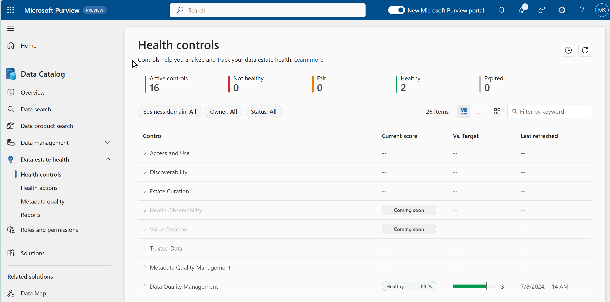
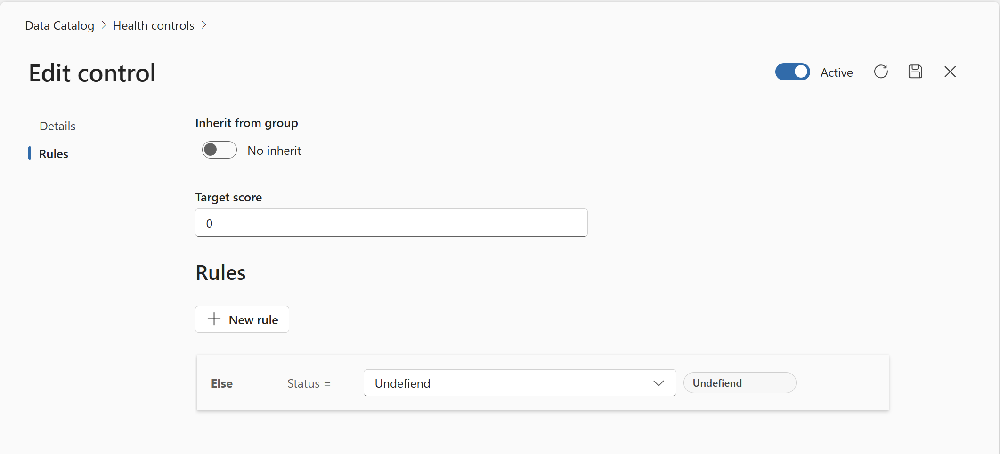
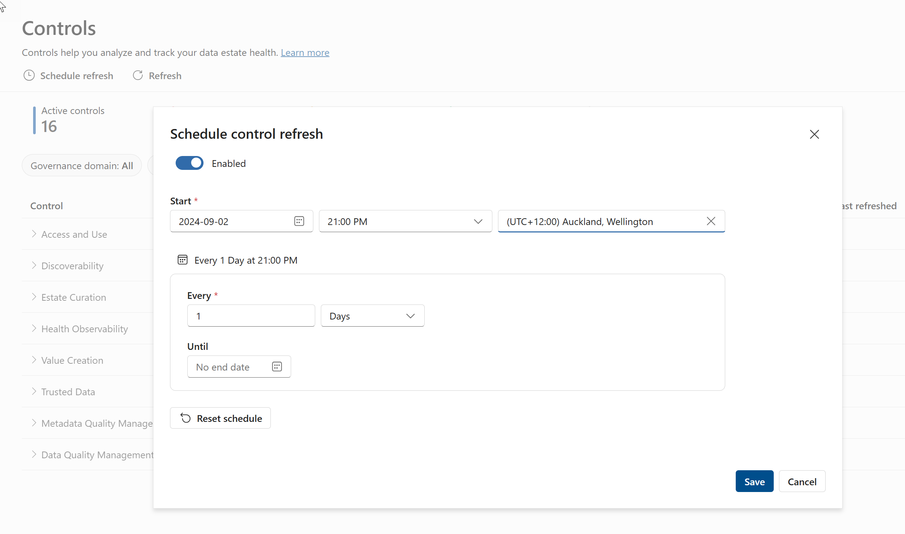

# Lab X: Data Estate Health Overview
**⏰ Duration:** 30 minutes

**🎯 Outcome:** At the end of this task you will understand the importance of data estate health and the tools provided by Purview to manage data estate health. 

## Introduction
Data estate health is the degree to which an organization's data assets are accurate, consistent, complete, accessible, secure, and compliant with business rules and regulations. Data estate health is a key factor for ensuring data quality, trust, and value across the data lifecycle. 

In the age of AI , it is imperative that we have accurate information about the health of our data to ensure that our models can provide the most best insights grounded on reliable and trustworthy data. 

While organizations understand the need to have healthy data and the key requirements for achieving data health, they very seldom have practices in place to evaluate the health of their estate. 

The purpose of Data Estate Health is Purview is to provide customers with the tools they need to evaluate the progress on their quest for healthy data.  Given that data estates are growing rapidly managing the data itself is challenging enough, staying on top of data health is often treated as a secondary objective. 

By having a toolset available which can quantify the health of the data estate, emphasis can be placed on the importance and need to have a more proactive and dedicated approach to improving data health and drive behaviour and decisions to actively improve it. 

## Task 1: Understand the Data Estate Health Controls 

> Microsoft Purview Solution: Data Data Catalog 

**⏰ Duration:** 15 minutes

**🎯 Outcome:** At the end of this task you will understand the 8 key pillars for data estate health. In Purview these case be considered the health control groupings. All individual controls fall into one of these groups. 

### What are the 8 Key Pillars for Data Estate Health?
With health controls you can define and measure the vital signs of your data across the 8 key pillars critical for the health of any data estate: 

- Access and use

  Do we have the right policies and procedures in place to facilitate access and compliant use of data? I.e. Do we have self-service data access policies in place? Are users declaring the intended use of the data?
- Discoverability:

  Are we enabling users to find the data they need? To what extent have we made data products available to our users with relevant data assets mapped. 

- Estate Curation 

   Are data products suitably classified and labelled? 

- Health Observability

   Do we have the right tools in place to monitor the health of our data estate?

- Value Creation

  Are data products aligned to business outcomes?

- Trusted Data

   Do we know who owns the data? Has it been certified and quality checked? 

- Metadata Quality Management

   How well are the data products and assets described?
   
- Data Quality Management

   What is the quality of our data in terms of accuracy, completeness, conformity, uniqueness ,consistancy and timeliness?

### Exercise: Review Health Controls Dashboard

**🫂 Team Activity:** [15 minutes] Review the [available health controls](https://learn.microsoft.com/en-us/purview/how-to-health-controls) and discuss the importance of each of health control within your organization.

**✍️ Do in Purview:** [15 minutes] Using the Health controls tool, navigate to the Health Controls dashboard and review the health controls available.

Initially you will see a summary of the health controls and the number of controls that are in place. There will not be any current scores displays as these are calculated based on the controls that are in place and the rules that are defined.

- Active controls: The number of controls that are currently in place
- Not Healthy: The number of controls which are considered not healthy based on the health status rules that have been defined.
- Fair: The number of controls which are considered fair based on the health status rules that have been defined.
- Healthy: The number of controls which are considered healthy based on the health status rules that have been defined.
- Expired: ????

Click on a control name to view the details of the control. This will show you the control description, the health status, the owner, the business domain,the target value and when the control was created.

**✨ Pro Tip:** The Health controls dashboard allows you to view your data estate health at a glance as a grid, a treeview or a chart view. You can also filter the controls by health status, Business domain, owner or keyword.

---

## Task 2: Update Health Controls

> Microsoft Purview Solution: Data Catalog Health Controls

**⏰ Duration:** 15 minutes

**🎯 Outcome:** At the end of this tasks, you will have updated the properties of a health control. 

### Exercise: Edit health control properties

**✍️ Do in Purview:**  [10 minutes] 
1. Using either the treeview or grid view, select a health control and click on the Edit button. (The edit button is the pencil icon). This will bring you to the Edit control window for the specific control. 

2. Update the owner of the control

3. Update the description of the control

4. Select the business domains that the control is applicable to.

5. Decide if the control is active or not.

**✍️ Do in Purview:** [15 minutes] Update health control status rules.

1. While in the Edit control window, click on the rules tab. This will show you the status rules that are in place for the control. Status rules can be configured at the control group level (default) or at the individual control level.
   

2. Click on the Add rule button, which will add an if-then statement  where you can configure the condition for one of the following statuses: 
   - Healthy
   - Fair
   - Not healthy
   - Critical
   - Undefined

3. Configure the rule by selecting the condition, the operator and the target value. These rules determines how the score will be displayed on the Health Controls dashboard.

4. Click on the save icon to save your control changes and close the window.

5. Schedule control refreshes by clicking on the clock icon at the top right of the health controls screen. 
   - Select a start date and time for the refresh
   - Select the desired time zone
   - select the frequency of the refresh (daily, weekly, monthly)

This schedule applies to all the health control tools???

**⏸️ Wait:** Wait for the control refresh to run and check the health control dashboard to see the updated health status of the control.

👉 [Continue: MEH Lab 2](./Min-Lab-02 Metadata quality.md)
